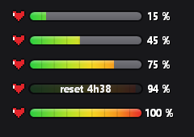

# 🎮 Token XP Bar — jauge de consommation Claude

Une petite **barre d'XP façon jeu vidéo** qui affiche ta consommation Claude
(limite **« Session 5h »**) en direct, flottante en haut à droite de l'écran,
**uniquement quand VS Code est ta fenêtre active**.

La jauge se remplit du **vert** (0 %) au **rouge** (100 %), avec le pourcentage
à droite. Au **survol**, elle affiche le temps restant avant la remise à zéro.

---

## ✨ Fonctionnalités

- ❤️ Cœur pixel 8-bit + jauge fine à contour noir, dégradé progressif vert → rouge.
- 📊 **Vraie donnée officielle** (identique au site claude.ai et au panneau
  « Account & Usage » de VS Code) : lue en local, aucun mot de passe demandé.
- 👀 Visible **seulement quand VS Code est actif** (disparaît quand tu changes de fenêtre).
- ⏱️ Survol → temps avant reset. Glisser → déplacer. Clic → rafraîchir. Clic droit → menu.
- 🚀 Démarrage automatique avec Windows.
- 🔌 **S'adapte tout seul à ton compte** (Pro ou Max) : aucune config, aucune limite à saisir.

---

## 📥 Installation (Windows)

1. **Télécharge le projet** : bouton vert **`Code`** → **`Download ZIP`**
   *(ou `git clone` si tu connais).*
2. **Extrais** le ZIP, ouvre le dossier.
3. **Double-clique sur `Installer.bat`**.
4. Si Windows affiche un écran bleu *« Windows a protégé votre ordinateur »* :
   **Informations complémentaires → Exécuter quand même**
   *(normal pour un fichier venu d'internet — il est sain).*
5. Ouvre VS Code pour voir la barre apparaître en haut à droite. ✅

Pour l'enlever : double-clique sur **`Desinstaller.bat`**.

---

## ⚙️ Comment ça marche

Claude Code stocke ta consommation réelle en local dans
`~/.claude.json` (champ `cachedUsageUtilization`). La barre lit ce fichier et
surveille sa date de modification pour se mettre à jour **dans la seconde**
dès que Claude Code y écrit une nouvelle valeur.

> ℹ️ Le chiffre avance **par paliers de quelques minutes** : c'est Claude Code
> qui rafraîchit sa donnée de temps en temps (exactement comme le panneau
> officiel de VS Code). Si le % reste figé un moment, c'est simplement qu'il
> n'y a pas eu de nouvelle consommation.

---

## 📋 Prérequis

- **Windows** (10 / 11) — utilise PowerShell + WinForms (déjà inclus, rien à installer).
- **VS Code** avec **Claude Code**, **connecté à ton compte** (`claude` → `/login`).
  C'est lui qui fournit le chiffre officiel.

> 🔌 **Aucune configuration de compte.** La barre lit automatiquement le compte
> connecté à Claude Code — **Pro ou Max**, peu importe. La limite en tokens
> diffère selon le plan : la barre l'**apprend toute seule** en quelques
> rafraîchissements et s'y cale (aucun réglage manuel).

---

## 🛠️ Structure

| Fichier | Rôle |
|---|---|
| `TokenBar.ps1` | La barre (interface graphique). |
| `Get-TokenUsage.ps1` | Lecture de la conso officielle (+ repli local). |
| `Start-TokenBar.vbs` | Lanceur silencieux (sans fenêtre console). |
| `Install-Autostart.ps1` | Active/retire le démarrage automatique. |
| `Installer.bat` / `Desinstaller.bat` | Installation / désinstallation en un double-clic. |

---

## 📄 Licence

MIT — fais-en ce que tu veux. 🙂
